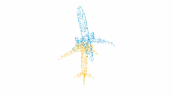

# VCR-Net: Visual Corresponding for Registraion

## Quick Visualization


This is the our IROS 2020 work. VCR-Net is a deep-learning approach designed for performing rigid partial-partial point cloud registration. Our paper can be found on [Arxiv](https://arxiv.org/pdf/2011.14579.pdf).

```
@inproceedings{qiao2020vcrnet, 
    title={End-to-End 3D Point Cloud Learning for Registration Task Using Virtual Correspondences}, 
    author={Zhijian Qiao, Zhe Liu, Chuanzhe Suo, Huanshu Wei, Hesheng Wang}, 
    booktitle={The IEEE/RSJ International Conference on Intelligent Robots and Systems(IROS)},
    year={2020} 
}
```
## Prerequisites
```
sympy 
h5py 
tqdm 
tensorboardX  
torchvision==0.7.0 
pytorch==1.6.0
```

### whole to whole 
Train
```buildoutcfg
#pre-train
python main.py --dataset=modelnet40 --test_batch_size=16 --batch_size=16 --model=lpd
#train
python main.py --dataset=modelnet40 --test_batch_size=16 --batch_size=4 -model_path=./pretrained/lpd-pretrained.t7 
```
Test
```buildoutcfg
python main.py --dataset=modelnet40 --test_batch_size=16 --batch_size=4 --model_path=./pretrained/vcrnet-whole.t7 --eval
```

### part to part 
Train
```buildoutcfg
python main.py --dataset=modelnet40 --test_batch_size=24 --batch_size=4  --partial  --overlap=0.575 ---model_path=./pretrained/vcrnet-whole.t7
```
Test
```buildoutcfg
python main.py --dataset=modelnet40 --test_batch_size=24 --batch_size=4 --partial  --overlap=0.575 --model_path=./pretrained/vcrnet-part.t7 --iter=3 --eval
```


### Thanks
[DCP](https://github.com/WangYueFt/dcp.git)

[Zhuowen Shen](https://github.com/MickShen7558)
